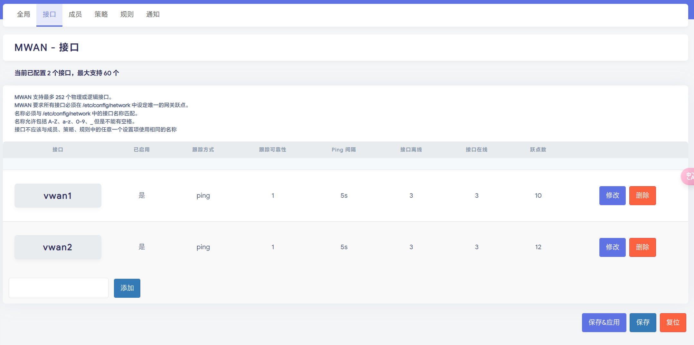
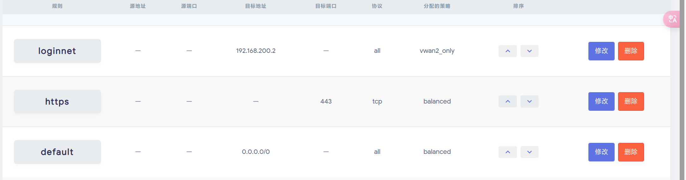

# 基于Openwrt的校园网单线多拨方案

> **作者：kikyo**
>
> ***Email：sjh10075@outlook.com*** 
>
> Update：2025-9-17

  笔者所在CQUPT校园网每台设备限速50Mbps，每个账号限制两台设备同时在线，在2024年这个网速还是十分影响体验的，同时由于我有三台设备（手机、电脑、平板），需要同时上网也不希望频繁切换登录设备，遂购入一台红米AC2100，刷入openwrt固件，开启单线多拨，多线程网速提升至100Mbps，基本满足上网需求。

> **注：实际网速=虚拟网卡登录设备数目*50Mbps≤光猫上限**

> [!TIP]
>
> 更新日志：原有的刷入breed的方法已经失效，现采用本地http服务的方法实现刷入,原有的开启ssh的方法现已有更简单的xmir-patcher实现。


## 教程

需要准备的东西：

> [!TIP]
>
>  > 1. 一台可以刷Openwrt的路由器（软路由亦可）(推荐红米AC2100)
>  >
>  > 2. 一根网线（最好是CAT5E及以上的）
>  >
>  > 3. 一台电脑（带RJ45网口）（亦可通过C口转接）
>  >
>  > 4. Xterminal 软件
>  >
>  > 5. WINSCP 软件
>  >
>  > 6. 一双灵巧的手和聪慧的大脑
>  >
>  > 7. 勇敢直面问题的勇气
>
> **PS：本教程用到的软件、固件包等会在文章末分享**
>
> ***本教程针对红米AC2100，其他路由器请自行查阅资料刷入openwrt，成功刷入openwrt后的步骤相同.***

------

## 1. 刷入breed

> Breed【不死】，是一个由国内个人*hackpascal*开发的*Bootloader*引导程序，成功刷入breed后，就可以借助它刷入第三方路由器固件
>
> <u>**刷入breed的方法较多，本文介绍两个相对简单的方法，其他方法请自行查阅相关教程**</u>

------

> (1). 直接刷入法 **（本地http服务）**
>
> a. 固件降级
>
> 1. 进入后台 192.168.31.1->常用设置->系统状态->手动升级
> 2. 加载固件，可以保留数据->开始升级
>
> b. 直接刷入breed
>
> > [!TIP]
> >
> > 电脑需要有线连接到路由器的LAN口
>
> - 电脑浏览器（推荐）进入 `192.168.31.1` ，复制自己的stok，即网页地址栏出现的 `192.168.31.1/……/stok=stok值`（这部分）
> - 运行HFS，将breed固件`breed-mt7621-xiaomi-r3g.bin`拖入HFS，记录HFS导航栏的IP地址*（一般为192.168.31.XX）*。
> - 修改代码中的IP地址<u>*（curl命令这一行）*</u>
>
> ```
> 
> cd /tmp
> curl -o B -O https://192.168.31.xx/breed-mt7621-xiaomi-r3g.bin -k -g
> [ -z "$(sha256sum B | grep 242d42eb5f5aaa67ddc9c1baf1acdf58d289e3f792adfdd77b589b9dc71eff85)" ] || mtd -r write B Bootloader
> ```
>
> - 将修改后的代码复制 **（注意完整复制，cd前面还有一个换行符）** 进行url encode,推荐在线url Encode网址：[URL ENCODE](https://www.tbfl.store/dev/urlcode.html)
>
> - 将url encode后的代码拼接再下面的代码后面并修改stok值
>
>   ```
>   http://192.168.31.1/cgi-bin/luci/;stok=stok值/api/misystem/set_config_iotdev?bssid=Xiaomi&user_id=longdike&ssid=
>   ```
>
>   

>
>3. 浏览器地址栏输入刚才的处理过的代码，回车。
>-   不出意外的话，你的路由器会在60秒内重启，system指示灯变为黄色，最终变蓝成功进入系统，代表刷入breed成功
>-   接下来，将路由器断电，按住reset，接通电源，等待10秒，路由器蓝色灯光闪烁，代表进入breed，用网线将路由器和电脑连接，浏览器地址栏输入`192.168.1.1`进入breed控制台 

------

> (2)ssh刷入
>
> a.固件降级
>
> -   进入后台 `192.168.31.1`->常用设置->系统状态->手动升级
> -   加载固件，可以保留数据->开始升级
>
> b.获取ssh权限
>
> - [xmir-patcher](https://github.com/openwrt-xiaomi/xmir-patcher)中下载patch工具 *<u>（如网络不佳可下载打包资源，详见文章末）</u>*下载完成后解压并运行  *run.bat*
>
> - 如果你未更改过网关地址，输入2回车并等待输入web登录密码
>
> - 如果你更改过网关地址，按1输入正确的网关地址，再进行上面相同的操作
>
>   > [!TIP]
>   >
>   > 不出意外的话，脚本的输出结果最后应当显示 `SSH server are activated` ，表明ssh服务已正常开启。
>
> c. ssh连接刷入breed
>
> -   打开Xterminal，新建服务器，IP为192.168.31.1，22端口，账户为root，密码为root
> -   打开WINSCP，新建站点，选择SCP协议，主机为192.168.31.1，22端口，密码和用户名均为root
> -   将``breed-mt7621-xiaomi-r3g.bin``文件上传到根目录下的tmp文件夹（/tmp）（注意是根目录下的，不是tmp文件夹下的tmp文件夹）
> -   打开Xterminal ssh命令执行 
>
> ```BASH
> mtd -r write /tmp/breed-mt7621-xiaomi-r3g.bin Bootloader
> ```
>
> - 不出意外的话，你的路由器会在60秒内重启，system指示灯变为黄色，最终变蓝成功进入系统，代表刷入breed成功
> - 接下来，将路由器断电，按住reset，接通电源，等待10秒，路由器蓝色灯光闪烁，代表进入breed，用网线将路由器和电脑连接，浏览器地址栏输入`192.168.1.1`进入breed控制台

------

## 2. 刷入openwrt

> - 进入breed控制台后，在环境变量中添加`xiaomi.r3g.bootfw` 值为`2`.
>
> - 文件里有两个固件包，带DE字样的是防校园网检测设备共享固件，如你的校园网不检测网络共享，可以刷入不带DE的固件
> - 点击更新固件，内存布局选择`R3G_openwrt`，上传`kenel1` 和`rootfs0`文件，勾选自动重启，确认等待自动更新，并开机，第一次开机所需的时间较长，请耐心等待
> - 开机后WiFi会出现`openwrt_5G`和`Openwrt_2G`两个wifi,将路由器连接至网络（可以有线接入，手机连接路由器WiFi会弹出登录页面）,电脑连接路由器
> - 打开Xterminal，打开终端，更改配置，输入
>
> ```bash
> ssh root@192.168.1.1
> ```
>
>   提示输入密码 默认密码为 `password` （输入密码过程中看不到密码，请输入后按回车即可），即可进入控制台
>
> >[!TIP]
> >
> >警告：DE版本的固件无法自动开启WiFi，第一次刷入固件开机后，有线连接电脑，进入`192.168.1.1`，路由器后台，密码为 `password`
> >
> >在 系统->启动项->本地启动脚本，在`exit0`前加入如下语句 `/sbin/mtkwifi up` 保存应用重启路由器即可
>
> 

## 3. 单线多拨

------

> 1. 添加虚拟网卡
>
> ```bash
> opkg update
> opkg install kmod-macvlan
> ```
>
> 2. 添加启用虚拟网卡
>
>   ```bash
>   ip link add link eth1 name veth0 type macvlan # 添加一个类型为macvlan，名字为veth0的虚拟网卡，并通过虚拟链路和eth1连接起来
>   ifconfig veth0 up # 启用创建的veth0网卡
>   ```
>
>   注意`eth1`是接口中物理WAN卡的名称，如果提示找你不到接口，请检查名称
>
>   以上方法创建的虚拟网卡会在重启后失效，如需永久设置，参考下面的方法
>
> 在`/etc/config/network`中
>  添加以下代码
>
> ```bash
> config device 'veth0'
>     option name 'veth0'
>     option ifname 'eth1'
>     option type 'macvlan'
> ```
>
>   输入 `ifconfig`检查列表中是否有添加的虚拟网卡
>
> 3. 虚拟网卡配置
>
>    进入Openwrt后台，点击网络→接口，暂时将WAN口禁用，避免虚拟网卡获取不到ip地址，添加新接口，设备选择虚拟网卡veth0，然后创建接口。名称建议设置为 vwan1，设备为虚拟网卡veth0，协议为DHCP服务器，网关跃点随便设置。但是不要和其他WAN口重复，防火墙选择wan，保存即可。
>
>    此时将校园网后台设备下线，Vwan1连接到校园网，成功获取ip后，手机连接路由器WiFi登校园网，检查网络是否正常。
>
>    再创建一个接口，按同样的方法再创建一个虚拟网卡vwan2。这时vwan2还未连上校园网，只是自动获取了IP地址
>
> 4. 负载均衡	
>
>    终端输入`opkg install mwan3 luci-app-mwan3`	
>
>    安装完后到网络→负载均衡界面，把接口、成员、策略、规则里面的配置全部删掉
>    在接口里面新增vwan1，名字要和在网络→接口添加的接口名相同，否则无法匹配接口
>    勾选启用，填入跟踪的IP，接口会ping这个IP检查自己是否在线。其他配置保持默认就行
>
> 
>
>    添加两个接口，如下图
>
> 

>    注意，跃点数是不是数值，显示“-”是接口的跃点数没指定，回到网络→接口重新指定，或者填的接口名称不对应，还有不同接口间的跃点数是否不同, 路由优先发往跃点值较小的接口。跃点值相同的接口，按权重走路由。如果你用的是同一个号，网速相同，推荐相同跃点数，权重1:1，其他请自行确定
>
>    

>    如下图添加三个策略，注意分配的成员这一项
>
>    

> 按照下图添加规则，注意，`loginnet` 的目标地址为校园网的登录地址
>
> 
>
> 登陆之后检查所有接口是否都在线，状态→负载均衡，此时将连接的那一个接口断开，在接口中连接未在线的接口
>
> 可以使用如下命令
>
> ```bash
> ifdown vwan0 #断开VWAN2  不要复制代码，请确认自己哪个接口连接了，哪个没连接
> ifup vwan1 #连接VWAN1
> ```
>
> 连接口换一台设备登录校园网（如果是限制一台手机就换电脑，限制几台设备登录换另一台设备，保证另一个端口不会被挤下线）
>
> > **注意：却换登录时要更改loginnet的策略并断开已连接的虚拟网卡**
> > 重新连接两个端口，测速发现，此时网速已经翻倍

------

## 其他问题

1. 我的学校每天晚上会断网第二天怎么重新连接？

	你可以使用计划任务，代码格式为

	```bash
	* * * * * 需要执行的命令
	- - - - -
	| | | | |
	| | | | ----- 一星期中的第几天 (0 - 6) (其中0表示星期日)
	| | | ------- 月份 (1 - 12)
	| | --------- 一个月中的第几天 (1 - 31)
	| ----------- 一天中的第几小时 (0 - 23)
	------------- 一小时中的第几分钟 (0 - 59)
	"*"代表可能的值,","用于分开列表范围，"-"表示整数范围，"/"表示间隔频率
	#举例如下
	18 6 * * * ifdown vwan1 #每天6点18断开VWAN1
	18 6 * * * ifdown vwan2 #每天6点18断开VWAN2
	20 6 * * *  ifup vwan1 #每天6点20连接VWAN1
	20 6 * * *  ifup vwan2 #每天6点20连接VWAN2
	25 6 * * * wifi down #每天6点2断开WIFI
	25 6 * * * wifi up #每天6点25连接WIFI
	0-23/2 #每两小时执行一次
	```

	

2. 我的校园网有时候会断连，怎么重新连接？

      定时ping两个外网地址，连续N次无法ping通，则重启网卡

    ping 脚本位置` /root/ping/ping.sh` 

   代码如下

```bash
#!/bin/sh

#ping 的总次数
PING_SUM=3

#ping 的间隔时间，单位秒
SLEEP_SEC=60

#连续重启网卡 REBOOT_CNT 次网络都没有恢复正常，重启路由器
#时间= (SLEEP_SEC * PING_SUM + 20) * REBOOT_CNT
REBOOT_CNT=30

LOG_PATH="/root/ping/log.txt"

cnt=0
reboot_cnt=0
while :
do
    ping -c 1 -W 1 114.114.114.114 > /dev/null
    ret=$?
    
    ping -c 1 -W 1 223.6.6.6 > /dev/null
    ret2=$?
  
    if [[ $ret -eq 0 || $ret2 -eq 0 ]]
    then
        echo 'Network OK!'
        cnt=0
        reboot_cnt=0
    else
        cnt=`expr $cnt + 1`
        echo -n `date '+%Y-%m-%d %H:%M:%S'` >> $LOG_PATH
        printf '-> [%d/%d] Network maybe disconnected,checking again after %d seconds!\r\n' $cnt $PING_SUM $SLEEP_SEC >> $LOG_PATH
        printf '-> [%d/%d] Network maybe disconnected,checking again after %d seconds!\r\n' $cnt $PING_SUM $SLEEP_SEC 
        
        if [ $cnt == $PING_SUM ]
        then
            echo 'ifup wan!!!' >> $LOG_PATH
            echo 'ifup wan!!!'
            
            ifdown vwan1
            ifdown vwan2
            ifdown wan
            sleep 1
            ifup wan
            ifup vwan1
            ifup vwan2
            
            cnt=0
            #重连后，等待20秒再进行ping检测
            sleep 20
            
            
            #网卡重启超过指定次数还没恢复正常，重启路由器
            reboot_cnt=`expr $reboot_cnt + 1`
            if [ $reboot_cnt == $REBOOT_CNT ]
            then
                echo -n `date '+%Y-%m-%d %H:%M:%S'` >> $LOG_PATH
                echo '-> =============== reboot!' >> $LOG_PATH
                echo '-> =============== reboot!'
                
                sshpass -p password ssh -p 22 root@192.168.1.1 'reboot'  
            fi
        fi
    fi
    
    sleep $SLEEP_SEC
done


```

保存脚本，`chmod+ xxx.sh`给予脚本权限

计划任务中新建执行脚本

3. 有没有能自动登录校园网的脚本？

	不同学校校园网登录检测方式不同，建议在GitHub上寻找自己学校的登录脚本

	> 资源打包地址:  链接：https://www.123684.com/s/TGUnjv-06mW3?pwd=rffO 
	>
	> 提取码：rffO
	>
	> 密码：kikyo
	>
	> > [!TIP]
	> >
	> > ***<u>下载无需付款，注册登录即可免费不限速下载。</u>***
	>
	> 
	> 如遇下载问题可邮箱联系。
	>
	> 
	>
	> **笔者水平有限，如有错误还望指正,技术交流欢迎联系。（未加主题会被过滤）**
	
	
